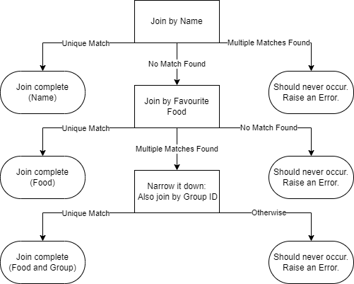

# Draft Example Usage of the Interface

Let's suppose we had two datasets as follows:

### `main_df`
|Name           |Group ID|Favourite Food  |
|---------------|--------|----------------|
|               |2       |Egg + Spam      |
|John Cleese    |        |Spam            |
|Eric Idle      |3       |Spam            |
|               |        |Egg Bacon + Spam|
|Terry Jones    |        |Egg             |
|Terry Gilliam  |2       |Spam            |
|Carol Cleveland|        |Egg             |
|Neil Innes     |1       |Spam            |

### `cheese_df`
|Name           |Group ID|Favourite Food  |Cheese Choice      |
|---------------|--------|----------------|-------------------|
|Graham Chapman |        |Egg + Spam      |Red Leicester      |
|John Marwood Cleese|3       |Spam            |Tilsit             |
|Eric Idle      |3       |Eggs            |Bel Paese          |
|Michael Palin  |        |Egg Bacon + Spam|Red Windsor        |
|Terry Jones    |2       |Egg             |Stitlton           |
|Winnie the Pooh|1       |Honey           |Gruyère            |
|Terrence Gilliam|2       |Spam            |Emmental           |
|Carol Cleveland|1       |Egg             |Norwegian Jarlsberg|
|Neil Innes     |1       |Egg             |Liptauer           |

We might want to join these two datasets together, but we have a problem: the names
don't match exactly. In this case, we could write some logic to automatically clean
the names and then join the datasets together. However, for a more complicated example,
this might not be possible so let's pretend we can't do that. In addition, some of the
names are missing entirely.

We might come up with the following strategy to join the datasets together:



This would be the expected output for the join:
### `join_df`
|Group ID       |Favourite Food|Name            |Cheese Choice      |Join Type     |
|---------------|--------------|----------------|-------------------|--------------|
|2              |Egg           |Graham Chapman  |Red Leicester      |Food          |
|3              |Spam          |John Marwood Cleese|Tilsit             |Food and Group|
|3              |Spam          |Eric Idle       |Bel Paese          |Name          |
|               |Egg Bacon + Spam|Michael Palin   |Red Windsor        |Food          |
|2              |Egg           |Terry Jones     |Stitlton           |Name          |
|2              |Spam          |Terry Gilliam   |Emmental           |Name          |
|1              |Egg           |Carol Cleveland |Norwegian Jarlsberg|Name          |
|1              |Spam          |Neil Innes      |Liptauer           |Name          |

And here's how you'd set that up using a `joinplex`-style interface:

```Python
name_join = ColJoin(main_df, cheese_df, on='Name')
food_join = ColJoin(main_df, cheese_df, on='Favourite Food')
group_id_join = ColJoin(main_df, cheese_df, on='Group ID')

# A plex is a general object representing a table operation - e.g. joining or filtering.
plex = OneManyNoneFunnel(
    name_join,
    one="Name",
    many=ValueError,
    none=OneManyNoneFunnel(
        food_join,
        one="Food",
        none=ValueError,
        many=OneElseFunnel(
            group_id_join,
            one="Food and Group",
            many_or_none=ValueError,
        )
    )
)

join_df = plex.run(
    label_col = 'Join Type',
    right_cols = ['Name'],
    combined_cols = ['Group ID']
)
```
Doing the same thing directly in `pandas` would be very tedious, and difficult to understand at a glance.

This example has been fairly straightforward. Joinplex should be able to handle more complicated examples, such as:
- Many-to-many, one-to-many and many-to-one joins
- Funnelling based on the number of matches on both sides of the join (e.g. one-to-one distinguished from many-to-one)
- Other join types than `ColJoin` - based on a functional comparisons, spatial joins using `geopandas`, etc.
- More complex funnelling logic involving cycles, multiple uses of the same join, etc., yet being economical with computation.
- Precedence: require that one join outcome is reached before another join is completed, and then restrict the possible join candidates only to those which are not already joined. This is useful in situations where you can use
"process of elimination" style logic - without ever getting a matching properly speaking.
