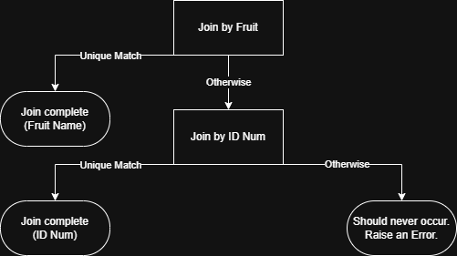
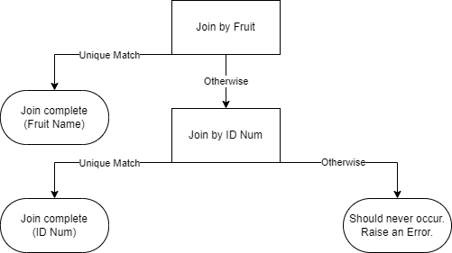

Simple Join Example
====================================

Let's suppose we had two datasets as follows:

.. table:: ``main_df``
    :class: longtable

    =============== ========
    Fruit           ID Num
    =============== ========
    Banana          1
    Orange          2
    Apple           3
    =============== ========

.. table:: ``colour_df``
    :class: longtable

    =================== ========= ========
    Fruit               ID Num    Colour
    =================== ========= ========
    \                   1         Yellow
    Orange              \         Orange
    Apple               3         Red
    Apple               4         Green
    =================== ========= ========

We might want to join these two datasets together, but we have a problem: the
``colour_df`` dataset is missing a value in the ``Fruit`` column for the first row.
Likewise, the it is missing a value in the ``ID Num`` column for the second row.

We might come up with the following strategy to join the datasets together:

This would be the expected output for the join:

.. table:: ``join_df``
    :class: longtable

    =============== ======== ======== ============
    Fruit           ID Num   Colour   Join Type
    =============== ======== ======== ============
    Banana          3        Yellow   ID Num
    Orange          2        Orange   Fruit Name
    Apple           3        Red      ID Num
    =============== ======== ======== ============

How do we get that output?

- The first row of ``main_df`` has a value of ``"Banana"`` in the ``"Fruit"`` column. We
  can see that the ``"Fruit"`` column in ``colour_df`` has no value equal to
  ``"Banana"``. So it instead, we use the value in the ``"ID Num"`` column. The value in
  the ``"ID Num"`` column in ``main_df`` is ``1``, which appears exactly once in the
  ``"ID Num"`` column in ``colour_df``. So we use that value to join the two rows
  together, noting that the ``Join Type`` is ``"ID Num"``-based:

=============== ======== ======== ============
Fruit           ID Num   Colour   Join Type
=============== ======== ======== ============
Banana          1        Yellow   ID Num
=============== ======== ======== ============

- The second row of ``main_df`` has a value of ``"Orange"`` in the ``"Fruit"`` column.
  We can see that the ``"Fruit"`` column in ``colour_df`` has exactly one value equal to
  ``"Orange"``. So we use that value to join the two rows together, noting that the
  ``Join Type`` is ``"Fruit Name"``-based:

=============== ======== ======== ============
Fruit           ID Num   Colour   Join Type
=============== ======== ======== ============
Orange          2        Orange   Fruit Name
=============== ======== ======== ============

- The third row of ``main_df`` has a value of ``"Apple"`` in the ``"Fruit"`` column.
  We can see that the ``"Fruit"`` column in ``colour_df`` has two values equal to
  ``"Apple"``. This leaves an ambiguity, so in addition we begin to use the value in the
  ``"ID Num"`` column. The value in the ``"ID Num"`` column in ``main_df`` is ``3``,
  which appears exactly once in the ``"ID Num"`` column in ``colour_df``. So we use that
  value to join the two rows together, noting that the ``Join Type`` is
  ``"ID Num"``-based:
=============== ======== ======== ============
Fruit           ID Num   Colour   Join Type
=============== ======== ======== ============
Apple           3        Red      ID Num
=============== ======== ======== ============

And here's how you'd set that up using a ``joinplex``-style interface:

.. code-block:: python

   name_join = ColJoin(main_df, colour_df, on='Fruit')
   id_join = ColJoin(main_df, colour_df, on='ID Num')

   # A plex is a general object representing a table operation - e.g. joining or filtering.
   plex = OneElseFunnel(
       name_join,
       one="Fruit Name",
       many_or_none=OneElseFunnel(
           id_join,
           one="ID Num",
           many_or_none=ValueError,
       )
   )

   join_df = plex.run(
       label_col = 'Join Type',
       left_cols = ['Fruit', 'ID Num']
   )

And here's equivalent ``pandas`` code:

.. code-block:: python

    main_df["row_id"] = range(len(main_df))
    name_join_df = main_df.merge(colour_df, how="inner", on="Fruit", suffixes=("", "_Name"))
    name_join_df.drop(columns=["ID Num_Name"], inplace=True)

    dupl_idx = name_join_df.duplicated(subset=main_df.columns, keep=False)
    dupl_name_join_df = name_join_df.loc[dupl_idx]
    one_name_join_df = name_join_df.loc[~dupl_idx]

    main_dupl_idx = main_df.index.isin(dupl_name_join_df.index)
    dupl_df = main_df.loc[main_dupl_idx]
    no_name_join_df = main_df.loc[~main_dupl_idx]

    id_dupl_join_df = dupl_df.merge(colour_df, how="inner", on=["Fruit", "ID Num"])
    id_no_join_df = no_name_join_df.merge(
        colour_df, how="inner", on=["ID Num"], suffixes=("", "_ID")
    )
    id_no_join_df.drop(columns=["Fruit_ID"], inplace=True)

    one_name_join_df["Join Type"] = "Fruit Name"
    id_dupl_join_df["Join Type"] = "ID Num"
    id_no_join_df["Join Type"] = "ID Num"

    join_df = pd.concat([one_name_join_df, id_dupl_join_df, id_no_join_df], axis="index")
    join_df.sort_values("row_id", inplace=True)
    join_df.reset_index(drop=True, inplace=True)
    join_df.drop(columns="row_id", inplace=True)
    main_df.drop(columns="row_id", inplace=True)

Oh No! Where to begin? This ``pandas`` code has some issues:

- The main one is that it's not very readable. It's very long, circuitous, and has a lot
  of intermediate variables and tables. It's hard to tell what's going on at a glance - and hard to tell whether
  there are any bugs.
- Another issue is that there's plenty of other ways to create equivalent ``pandas``
  code. There's not "One, and only one, obvious way to do it".
